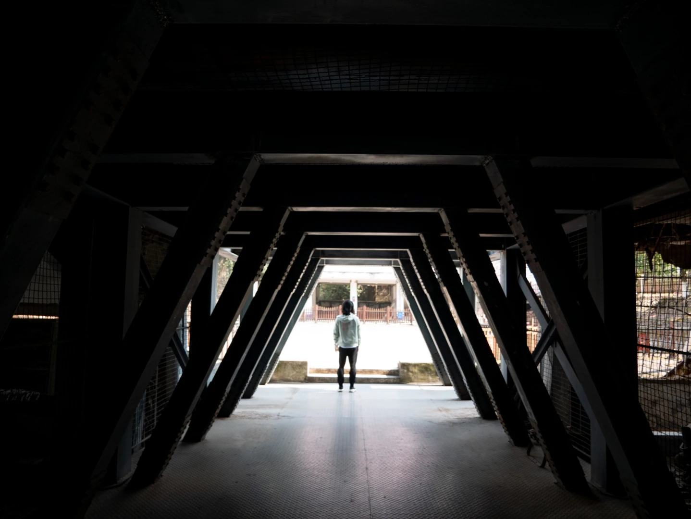
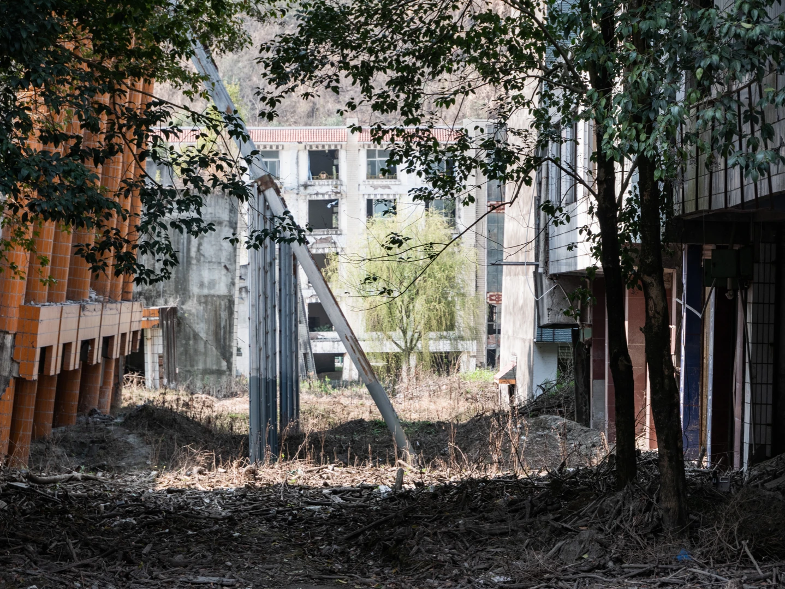
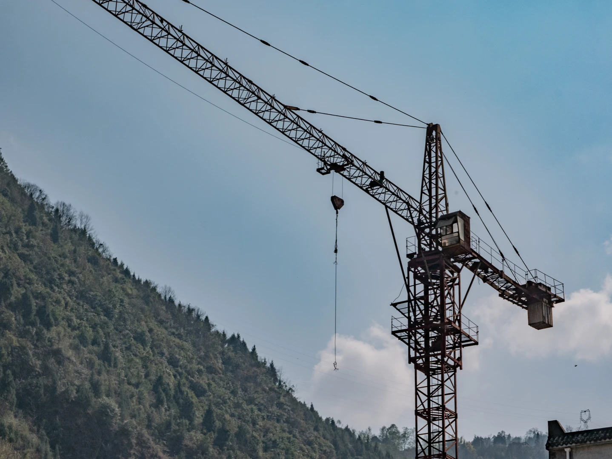
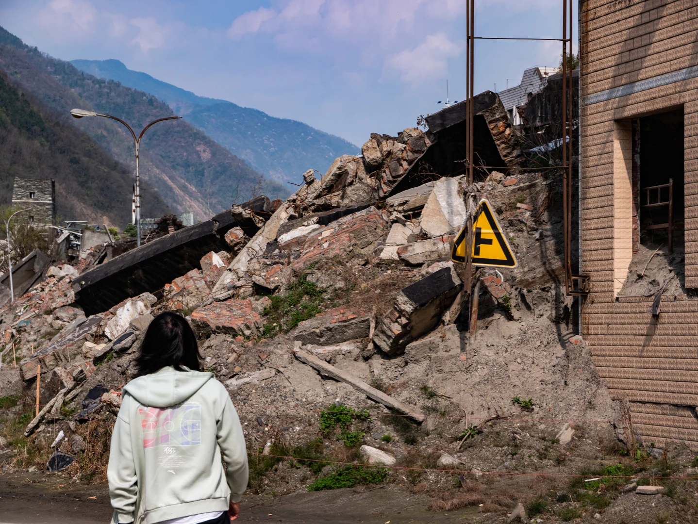
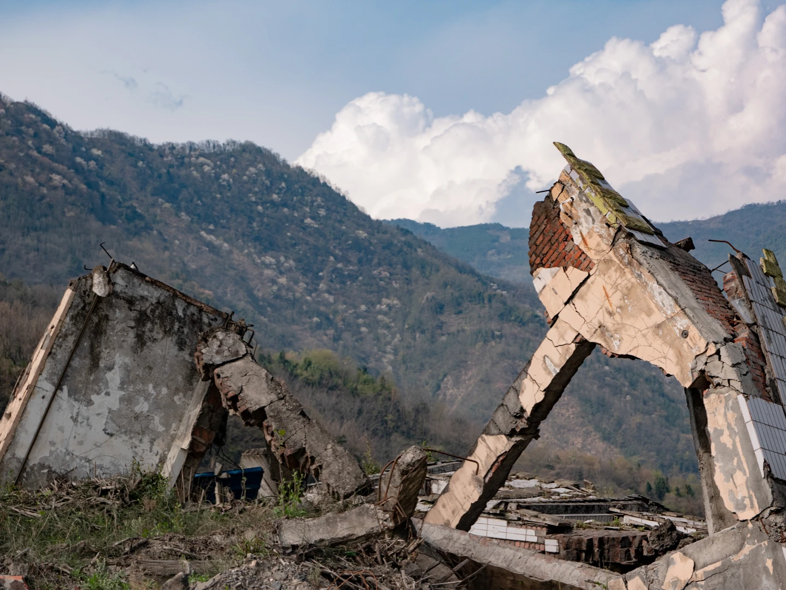
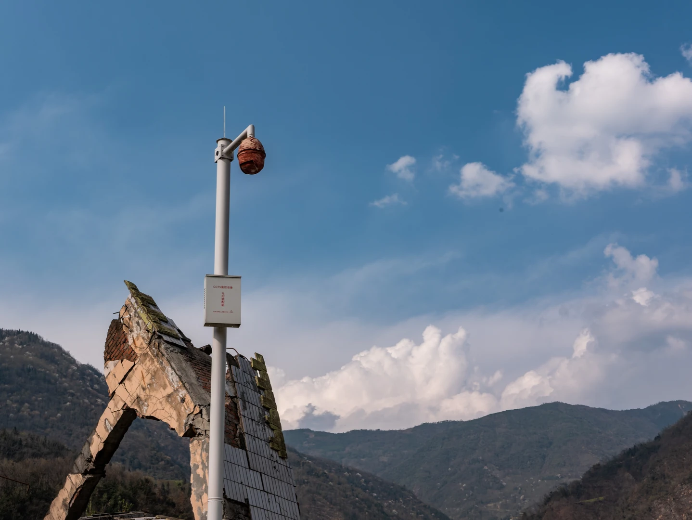
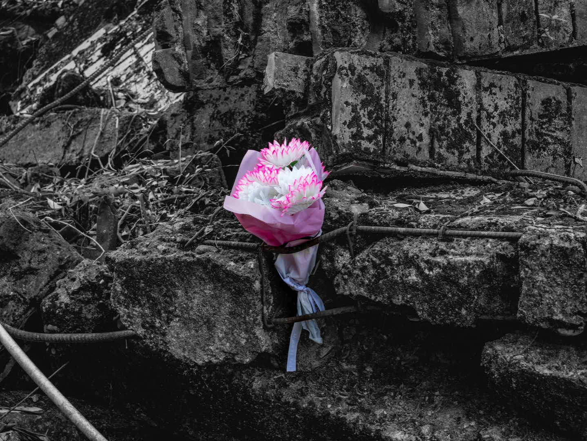
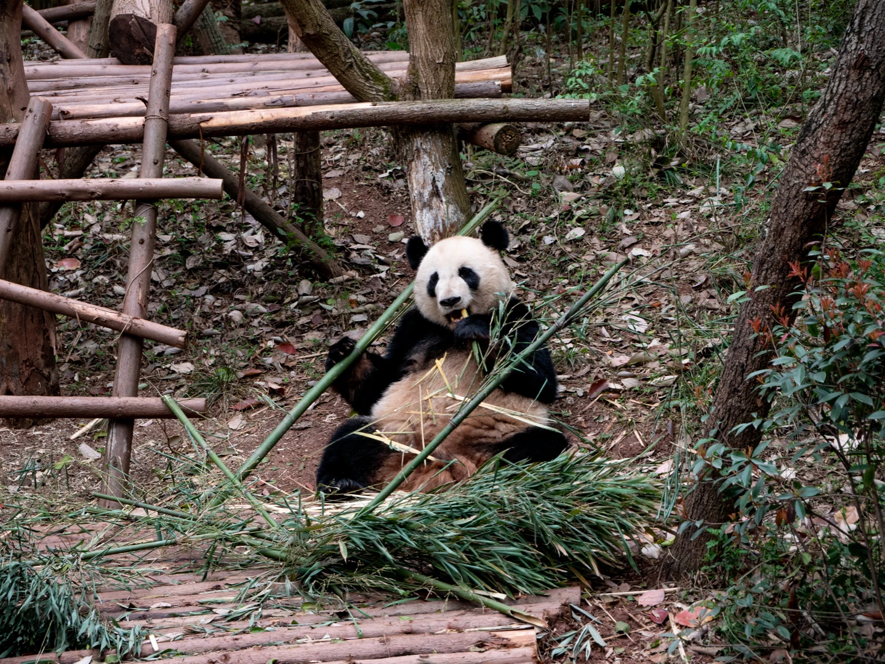
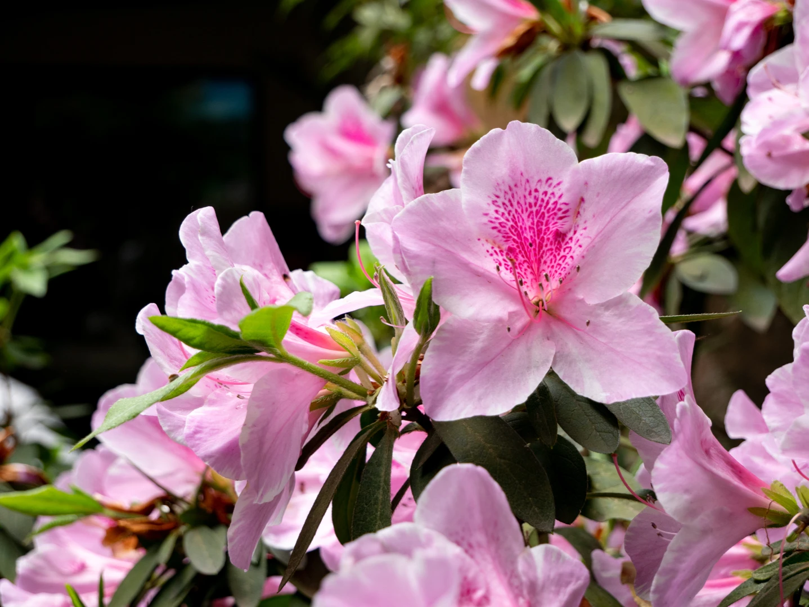

本次摄影包含了2023年3月在四川省绵阳市北川羌族自治县北川地震遗址拍摄的遗址照片，以及少量在四川省成都市大熊猫繁育基地拍摄的照片。下面是经过RAW修正后压缩的Best Pick。

_拍摄于北川地震遗址，北川警察局_

_拍摄于北川地震遗址，街边_

_拍摄于北川地震遗址，未完工的工程遗址_

_拍摄于北川地震遗址，倒塌的民房_

_拍摄于北川地震遗址，倒塌的民房_

_拍摄于北川地震遗址，倒塌的民房旁边，无法使用的摄像头_

_拍摄于北川地震遗址，倒塌民房上有人送了一束花_

_拍摄于成都大熊猫保护基地，熊猫正在吃饭_

_拍摄于成都大熊猫保护基地，行人道旁边的花_

_手办摄影，花园Serena手办_
