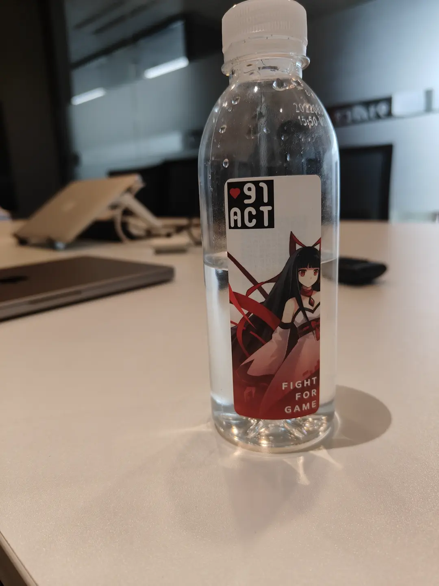

91Act是在九月份尝试投递的，当时是有一个朋友给我的内推码，我通过内推码去申请了他们的笔试。 我具体投递的岗位是客户端开发实习生，面试题基本上是与Unity相关的， 也问了一些简单的算法问题。 然后在10月10号，也就是国庆节之后，HR问我什么时候有空去参加他们的面试，于是我就在约定了12号进行面试。

接下来我就对这次面试做一些复盘。

## 如何到达公司

这次去面试是开车过去的，我把车停在了公司楼底底下的停车场。上楼时候发现我没有ID卡，因此无法进入公司，便找HR问了一下，她说要去前台那里登记才能让我进去。我把我的邮件给前台看，前台便让我登记个人信息，然后保安就把我带上了电梯，让我到达14楼。HR小姐姐就在公司门口给我开门，带我进去等待一会儿。

说实话，第一次面试还是比较紧张，不过HR给我的瓶装水还挺好看的。等待了大概10分钟左右就看到一位做技术方向的负责人过来了。

## 面试流程

面试整体都是跟着我的简历去走。首先我进行了一番自我介绍，接着便开始根据简历上所写的进行提问。基本上是从简历的前面一直聊到后面，接着又将我的笔试题拿出来问了一下，并且面对面聊了一下我没有做出来的算法题（当场也成功做出来了）， 然后又让我对他进行提问，最后问了一下版本管理工具，我们的面试就大体结束了。

### 自我介绍

我在开车前往公司的路上，就觉得可能他们要让我先自我介绍一下。于是我在路上先进行一些简单的自我介绍练习， 我猜肯定要对我个人的情况进行介绍。 当然在面试时，我还是比较紧张的，一开始还是比较流畅，把我的名字、学历情况、过往经历以及项目经历简单快速地介绍一次，但是中间确实有一些卡顿地方，我的语速也比较快，我有点担心这里会不会印象不太好。

同时，这位面试官也在我描述我的个人经历过程中开始进行了一些提问。 首先他询问了一下，我在校内的一些经历以及过往经验，包括我在社团的做了什么，有什么成就，带来什么效果等等问题。

接下来他开始对我的作品开始提问，首先是对我一直做着《心灵骇域》项目进行一些提问，主要包括这游戏是怎样的形式，大概的游戏效果以及一个目前的制作情况；接着又询问了一下我已经参加过GameJam活动情况，以及我做过的外包情况。

到此为止，我就基本上完成了，对于简历上自我介绍部分的提问环节，接下来就是技术相关的问题了。

### 技术提问

技术提问也是比较简单粗暴的，几乎就是从我的简历从头到尾，挑选出来一些这位面试官比较感兴趣的技术问题，然后他便从他的想法出发开始深度提问，包括实现逻辑以及实现方法。

#### 简历内《心灵骇域》部分

让他最感兴趣的问题是我是怎么在运行时将MonoBehaviour对象里面的更变进行序列化和反序列化的。 他所理解的是将对象的更变再次重新保存到游戏数据包内，而我所讲的是将更改保存到游戏存档内， 在我解释清楚这些问题之后他便开始详细问我是怎么实现的。

接下来他便询问了一下我所制作的FlowGraph，即可视化脚本系统，是怎么一个运作方式。我是先从我们最开始的版本聊起，将版本更新与带来的效果结合在一起，让面试官理解为什么我们会做出这样的更改以及更新带来的好效果。 他同时对我们的游戏开发流程有一些感兴趣的点。 刚开始，他以为这一套系统只是对话系统的附属品，但是在我具体解释之后，他才理解到这套系统是构建玩法体验的核心关键——我们是通过这一套可视化脚本系统将各个不同的玩法结合在一起。

在讨论这套脚本系统的时候，他同时对我所提出的“分帧执行”提出了一些有意思的提问。当有的操作不可分割时，我应当如何回避问题发生。我的回答是：我们的每一个操作都有中断标志位，如果这个标志位被设置，那么当中断发生的时候便会暂时跳过一次，直到标志位被清除。 同时我也提到一点，当开始运行脚本时，脚本不会在当前帧发生，而是在下一帧发生，其目的是为了让程序有机会去配置参数，比如说是哪一个对象触发这个操作。

现在我们又来讨论UI相关的问题。 他的提问是从输入控制器出发的，他首先提出一个问题，是我们在战斗中，我们是如何让不同输入来源混合在一起的。我的回答是，将角色控制器和输入解析器分离开，让二者之间通过消息总线进行通讯： 角色控制器只会去理解当前角色应该朝向哪里，往哪里移动；而我们的解析器就是要将我们的输入转换成角色控制器能理解的信息；将二者粘合的办法便是信号总线。

在完成这个问题的回答之后，他就开始问我遇到过什么困难：当前的UGUI无法正常让不同层次之间的Selectable导航分离。 我的解决方法也很简单，首先我写一个脚本定义Select的范围，接着我写了一个替代算法让Selectable在Select范围内进行搜索，并覆写Selectable的导航目标。

他也问到了一些JSON以及Scriptable Object相关的问题。 他想知道为什么我选择Scriptable Object来管理这些数据。我给出了回答是一方面是比较好写，另一方面能够让Unity托管这些资源。 不过我也提到我可以更换成其他的后端来管理这些数据。

最有意思的部分就来了，他开始向我提问存档系统是如何设计的。 我明确提出将内存中的数据和硬盘上数据分开看待的观点，我设计一个专用类来加载和卸载硬盘类的存档数据，但是运行时可用的存档数据只能有一份；同时当存档数据发生变化时，我会通过总线将数据变化信号传递给各个管理单元和模块，让他们有时间做出反应，譬如提交数据或者还原数据。

#### 简历内元宇宙外包《Healer》部分

这一部分我做的主要工作是版本管理以及些格式上的设计。这份外包涉及到多人协作，而我们的分工采用了相对传统的分支合并模式。

此时面试官便提到我所设计的数据格式是什么东西。这里我答的不是非常好，我刚开始以为面试官问的是我的数据结构是什么样子的，但实际上他想问的应该是和网络相关的一些问题，比如我走的是什么协议。 最后我向面试官揭示了这一个程序中，App和游戏之间的沟通方式之后，他便理解了我所做的工作。

同时他也比较好奇，有什么数据需要被传输，我便说游戏中玩家所做出操作需要提交给App，让App转发给服务器。

#### 简历内各种GameJam部分

面试官首先问我所参加的这些活动里面哪一个活动最有意思，我说是我在2022年和2023年所参加的两次GGJ。 这个地方我觉得回答得也不是很好，我没有着重讲技术上的问题，而是更多去描述他玩法上哪里好玩了。

接着面试官便向我提出个问题，我是怎么让游戏运行时压力下降30%的。 这个地方我用的是对象池，将游戏中的各种“快消品”池化，并且循环利用。 这个技术不能减轻内存压力，但是可以减轻计算压力。也因此这里最准确的回答应该是让CPU部分的使用效率下降30%。然而这个结论是我从任务管理器里面得到的， 于是面试官便建议让我使用引擎自带的性能调试工具去确认这个情况。 这里我觉得回答的也不好——其实在简历里都不应该写出这一段话的。

同时，我觉得如果说我能在这里主动提出2023年GGJ作品《落尘》中所使用的一些工具以及设计，那么我能回答的更好一些。 确实当时我紧张了一些，我的大脑也是一片浆糊。

#### 笔试时没有完成的两个算法问题

其实这两个算法很简单。

第一个算法是让我去求差集， 我的想法是使用哈希碰撞将结果排出来。 但是我没想到面试官他问我怎么去算哈希，这就是我不太会的地方。并不说不理解哈希原理，而是我不太清楚，他想问的具体是哪个哈希算法。接着面试官就追加了几个问题：

- 如果我自定义一个类，我应该怎么让这个自定义类能够算出一个哈希值。 我回答有两个方法，一个是使用默认的基于指针的哈希计算方法还有一个就是通过重载GetHashCode()来手动计算对象的哈希。 但是我并不清楚，为什么面试官要让我把这个方法的名字给一个字一个字的念出来。
- 如果类里面有部分元素是可以被哈希的，我应该怎么只让这部分元素被纳入哈希中，而抛弃其他元素？ 方法简单，就是不计算多余的元素。

第二个算法难度更大，要求我将一个字符串里面的字符统计个数，并且按照其顺序依次排到一个字符串里面。 我刚开始问能不能自定义一个数据结构，他说让我先试着不用这个。 大概想了两三分钟后，我提出了一个办法，用一个数组将字符映射在这个数组的不同下标上， 然后每统计到一个字符，就访问该字符所对应的数组元素，并让这个元素的整数值+1。 等把所有的字符统计完之后， 使用二叉树对其排序，然后遍历二叉树输出结果。

第二个问题的回答，面试官比较满意。但是在我写这篇文章时，我想了想，其实如果我当时能够将思路再整理一下，我应该可以得到更好的回答。但是我当时这两个算法没写出来时（不过是因为时间关系没空写了），我居然没有再去看这两道题的更好解答。 我本来就应该猜到他会来问我这些问题的。

### 我的提问环节

面试官让我提了一些我感兴趣的问题。我首先是询问了面试官的工龄，并且赞美了一下他的头发——当然是开玩笑的，实际上我是赞美面试官好年轻（确实没看出来都31岁了）。

接下来我询问了一些跟工资待遇相关的问题，首先我先表明了，我的目前状况，我每周只有四天能过来参与实习工作后，他便提出至少要保证四天的工作时间， 而且也说公司的制度是965，加班不会非常严重。 不过这个问题有一定存疑，因为按照我的朋友说法，策划加班加的比较凶。 总而言之，就是希望我能至少保证一个基础工时，不然把我招进去也挺尴尬的。 同时工资是按照天算的，每月结一次，也就是说我工作多少就给我多少钱的工资，不过具体情况要和HR进行交流后才能确认。

其次，我询问我能进哪一个项目组。他的回答是我会先进入技术中台接受一段时间的练习及培训，然后我才能够被分到我想要进的组。 我也在此表明了，我非常想进入格斗相关的一些项目组，我想挑战下不同的技术方向。 格斗游戏是这个公司的老本行。

还有些比较杂散的问题，我也没问太多，基本上就这几个了。

### 追加的一个技术问题

在我提问结束之后，面试官又追加问了我一个问题是关于项目版本管理的问题。 他问我不了解SVN的具体使用方法，我便答了我个人的一些观点。首先我并不会使用SVN，但是我会用这种思想的工具，比如PlasticSCM。 接着他便问我会不会用Git，我说还是比较熟悉的，他问我具体是图形化的还是命令行的，我说二者都会。 然后我们又扯了一些具体实际使用的情况，并且我也表达了我对SVN在游戏开发中的支持态度。接着他便说，公司就是在用SVN进行版本管理的。

### 结束技术面试并约定HR面

至此，技术面试到此结束。 由于今天不走运，HR出差不在，我就只能另寻他日再来HR面试了。

## 总结

总体而言，我觉得这次作为第一次面试效果还是很不错的，但是需要注意的是我这次是作为实习生，而非正式工。面试官在中途也提到说，如果是按照正式工的要求，整体难度和深度只会比这个更高。我不清楚，我在面试过程中的手势是否会影响面试官的判断，但我觉得也是个很有力的途径，让面试官专注于我的内容，只是说我还需要控制其幅度。但我最担心的还是语速过快，这是老问题了。

在我的发言阶段内，我有两次词穷，第一次是在我自我介绍之后我卡壳了，我不清楚该继续说什么；第二次是在技术面试过程中话题突然终结了一次，然后我又救场回来了。同时，我觉得我可能发言有点过度激烈了，好几次面试官想插其他的话题，我都没有及时的停下来——不过最后还是停下了。

整体复盘下来，我觉得大体上没有问题，但是前期准备工作还有一些欠缺，比如说我在笔试时没答出来的题，我居然没有事后再看下——即使我确实懂这几个问题。 同时面试官也提醒我网络开发工作太少了，我需要再去积累一些网络相关的开发经验。 同时我应该让我的简历更加实事求是一点，减去一点我并不太确定的东西。（虽然只是那个数据有点问题，但是也需要警惕这个点）
