我记得我在刚开始学习InputSystem的时候，国内还没有比较好的中文文档，于是我只好选择去翻阅[Unity官方的文档](https://docs.unity3d.com/Packages/com.unity.inputsystem@1.5/manual/index.html)与Youtube上面的一些视频。但是毕竟InputSystem和InputManager有着不少的差距，因此我必须承认在我刚开始学习的时候确实没有搞明白这个是什么玩意。但是我经过一段时间的实践后，我发现这玩意的构架实际上十分的清晰易懂，甚至和InputManager一样简单（只要你配置正确了）。所以我今天打算从一个不太一样的方法来渐进的上手InputSystem。

但是因为内容比较繁多，而且我怕我写到一半不想写了，所以打算把内容拆开来写吧。

闲话不多说，先来干吧！

不过我还要补充一点，我使用的版本是InputSystem 1.5.1 @ Unity 2021.3.20 LTS，但是今天讲的内容理论上是向下兼容的。

## 部署InputSystem

InputSystem是Unity官方的一个组件，因此你不需要去从Github之类的地方安装这玩意，直接用UPM来安装即可。打开Windows > Package Manager，找到窗口上方的Packages，调整为“Unity Registry”之后，使用搜索框“Input System”即可找到目标包。

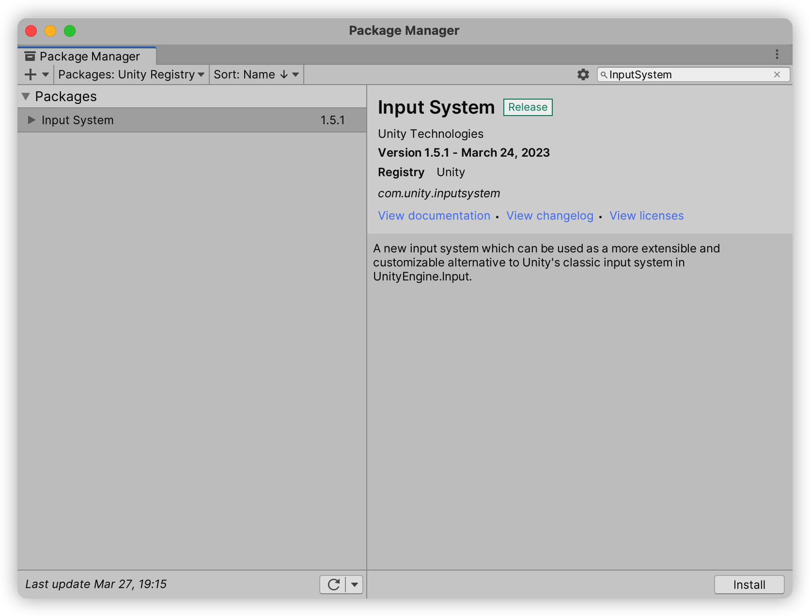
_找到InputSystem包后安装它_

按下右下角的“Install”并完成安装后，应该会弹出一个窗口提示你更换InputSystem作为输入系统。这个时候你就只需要确认，Unity Editor重启，然后就可以正常使用InputSystem了。

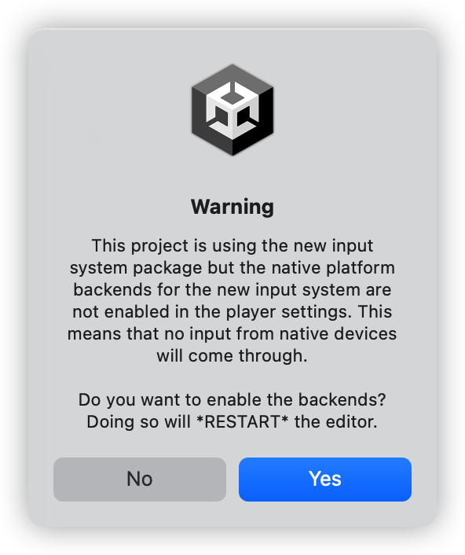
_在这里点击Yes即可_

接下来找到Edit > Project Settings > Input System Package，你会发现这个页面所有的配置都是灰色不可调整的，最上方有一个按钮提示“Create settings asset”。不要犹豫，赶紧点击创建一个先，避免不必要的找BUG时间。

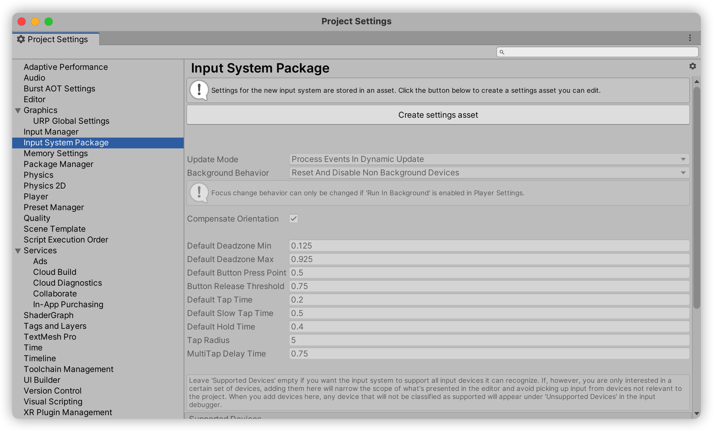
_点击“Create settings asset”以防无配置导致的BUG_

## 写第一个使用InputSystem的代码

如果你之前习惯了使用InputManager检测输入，那么你也一定喜欢这种写法：

```csharp
private void Update()
{
    if (Input.GetButtonDown("Jump") && isStandOnGround())
    {
        rb.AddForce(0, jumpForce, 0, ForceMode.Impulse);
    }
}
```

这个代码表明，当我们按下按钮“Jump”时，如果玩家目前正在地面上的话，那么我们给刚体添加一个向上跳跃的冲量使其跳跃。这种输入的处理模式也基本上就是分为检测和执行两个阶段。由于我们更换的是与检测相关的部分，所以我们并不需要主动替换具体的动作执行代码，而是`Input.GetButtonDown("Jump")`这一个东西。

我先说结论，把代码修改成这个样子就OK了（我先提示一下，先别当吉吉国王，现在还跑不成）：

```csharp
[SerializeField]
private InputAction jumpAction;

private void Update()
{
    if (jumpAction.WasPressedThisFrame() && isStandOnGround())
    {
        rb.AddForce(0, jumpForce, 0, ForceMode.Impulse);
    }
}
```

我创建了一个叫做jumpAction的field，而且还将其标记为可序列化域，这说明了三件事情：

- 首先，该InputAction是可以被Unity序列化的；
- 其次，通过名字可以猜测这对象是用来检测跳跃事件的，我们通过这个对象可以在每帧检测是否发生跳跃事件的按钮是否刚被按下；
- 第三，我们此时并没有通过直接的方式去检测按钮的状态，而是通过InputAction类代理查询某个我们并不确定的按钮的状态。

我们编译该代码，找个对象挂脚本，便可以在Inspector里面确认到我们Jump Action这个属性：

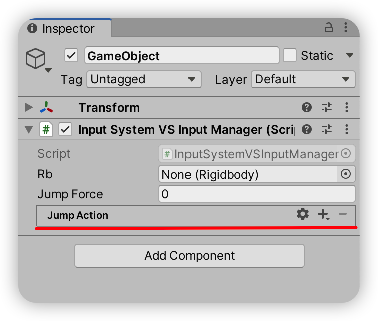
_Jump Action看起来不太像一个寻常的属性，对吧？_

找到Jump Action这个属性，找到位于右侧的加号，点击后弹出一堆带“Binding”字样的选项。选择第一个“Add Binding”后，在Jump Action内就出现了一个名为“No Binding”的项目。双击该项目会弹出一个页面，找到这个页面中的Binding > Path选项（注意，不要点击T按钮，而是下拉菜单）。

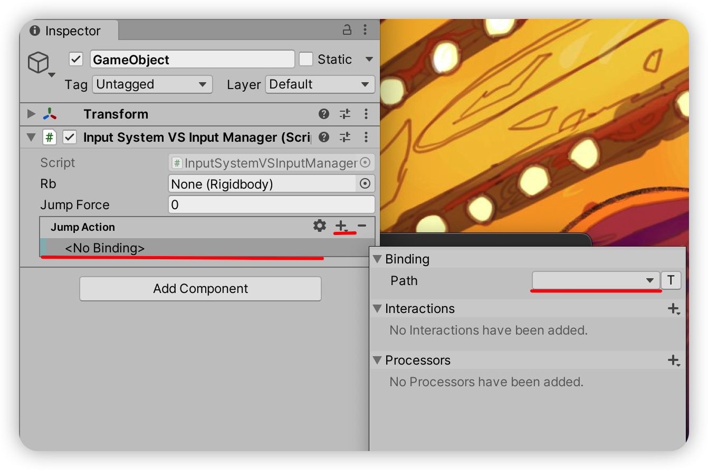
_根据红线提示去找哈_

当你打开这个菜单，恭喜你可以开始将某个具体的按钮绑定为Jump Action了！比如我想让空格键为跳跃，那么我就找到Keyboard > By location of key > Space让空格键成为跳跃按钮了。

### 让手柄和键盘都能触发跳跃事件

如果我想让Xbox手柄的B按钮也是跳跃按钮，那么我也只需要重复上述步骤，不过最终将新添加的Binding设置为Gamepad > Xbox Controller > B即可。（如果找不到目标按键，可以尝试使用弹出菜单的搜索功能，或者Listen功能进行按键监听检测）

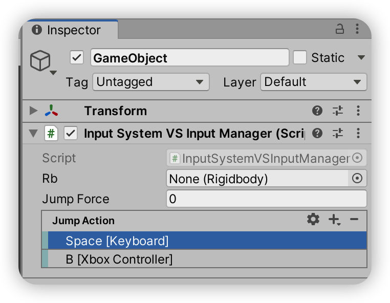

### 设置InputAction的ActionType

**继续之前，我需要在此定义两个东西**

InputAction：定义了具体触发方式与数值后处理的输入动作检测对象

InputBinding：InputAction所绑定的具体按键

最后找到Jump Action属性中，位于右上角的齿轮符号，在弹出的菜单中设置Action > Action Type为Button即可。

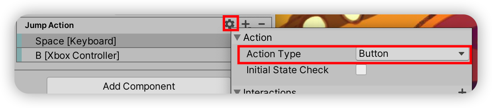
_手把手指导，还是有点烦……_

接下来你把RigidBody挂载好，设置正确的跳跃力度，然后插上手柄，启动游戏，然后……居然没有任何反应？！别急，还有一步没搞好！你还需要在OnEnable阶段使用`jumpAction.Enable()`才能让代码正常跑起来：

```csharp
[SerializeField]
private InputAction jumpAction;

// Actually you may better add those three calls to jumpAction.

private void OnEnable()
{
    jumpAction.Enable();
}

private void OnDisable()
{
    jumpAction.Disable();
}

private void OnDestroy()
{
    jumpAction.Dispose();
}

private void Update()
{
    if (jumpAction.WasPressedThisFrame() && isStandOnGround())
    {
        rb.AddForce(0, jumpForce, 0, ForceMode.Impulse);
    }
}

```

现在你再尝试启动游戏，如果不出意外的话，你的角色应该能跳起来了。如果出了意外，那你最好检查一下是不是哪里没配置正确。

### 响应双击事件

如果我觉得要让双击空格键才能让角色跳起来，那么我要怎么办呢？如果是传统的InputManager，我这个时候就应该在想写个协程来做双击检测了。但是我们是InputSystem，我们不需要这么麻烦，看我演示：

还是找到Space [Keyboard]选项，双击打开并弹出选项，找到Interaction标签右侧的加号，选择“Multi Tap”选项就可以了。

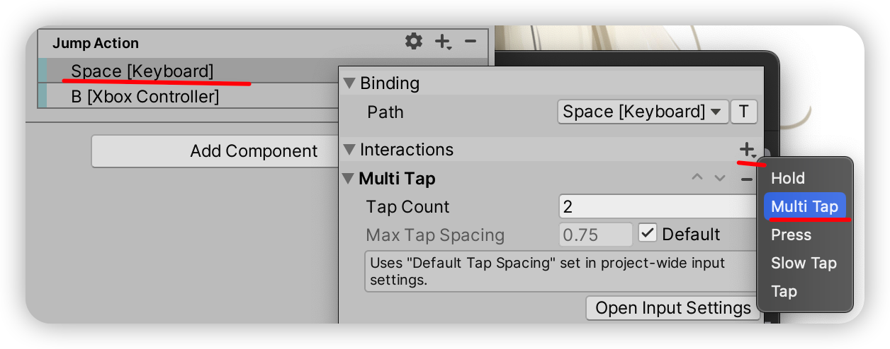

这里默认是2次按下，也就是双击检测。（如果你想修改为3击，那么就只需要修改Tap Count为3即可）接着我们需要在Update里面修改一点细节：

```csharp
private void Update()
{
    if (jumpAction.WasPerformedThisFrame() && isStandOnGround()) // 想看答案就直接往下读吧
    {
        rb.AddForce(0, jumpForce, 0, ForceMode.Impulse);
    }
}
```

没看出来？我调用的函数从`WasPressedThisFrame()`变成了`WasPerformedThisFrame()`。修改好之后你再尝试运行游戏，你就能发现双击空格键才能让角色跳跃了。

不过我非常的好事儿，我不仅仅想要双击空格键，还想要双击B键，那么请你不要急着按照刚刚讲的办法去给B [Xbox Controller]那玩意也加上Multi Tap，按我说的来。先去把Space [Keyboard]里面的Multi Tap删除掉先（理论上没啥影响，但是最好还是删掉，不留无用的东西）。

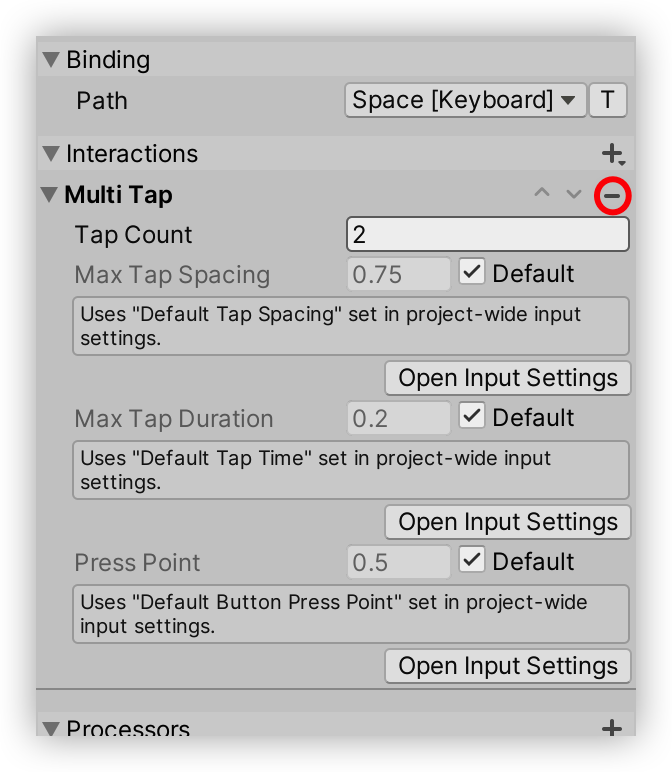
_找到红圈的按钮，按一下就删除了。_

接着找到Jump Action右上角的齿轮按钮里面Interaction的加号，在那里添加一个Multi Tap。

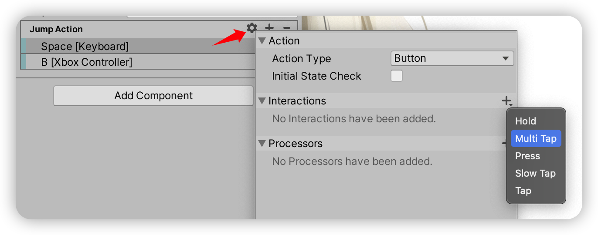

游戏启动之后，无论是双击Xbox的B键，还是双击空格键，我们都可以实现跳跃——而仅仅单击就不能跳跃了。

### 如果我想获取轴输入呢？

没法左右移动的平台跳跃是没有啥用的，所以我们还需要添加基于轴的输入。这一部分内容会比按钮还要复杂一点，不过也不麻烦，一步一步来。

首先还是老样子，仿照之前的代码来写移动代码：

```csharp
[SerializeField]
private InputAction jumpAction;

[SerializeField]
private InputAction moveAction;

private void OnEnable()
{
    jumpAction.Enable();
    moveAction.Enable();
}

private void OnDisable()
{
    jumpAction.Disable();
    moveAction.Disable();
}

private void OnDestroy()
{
    jumpAction.Dispose();
    moveAction.Dispose();
}

private void Update()
{
    if (jumpAction.WasPressedThisFrame() && isStandOnGround())
    {
        rb.AddForce(0, jumpForce, 0, ForceMode.Impulse);
    }
    else if (moveAction.WasPerformedThisFrame())
    {
        // 这里怎么办呢？
    }
}
```

现在摆在我们面前的问题是：怎样从InputAction中读取值？但是先不急，我们首先还需要去Unity内配置一下才能继续我们的讨论。打开Unity，找到我们挂载的脚本，此时就多了一个名为“Move Action”的属性。与刚刚一样的路数，我们首先要添加键盘绑定，但是……我们要添加什么绑定？我们总不可能直接添加按钮吧？这时就请添加“Add Up\Down\Left\Right Composite”这一种InputBinding：

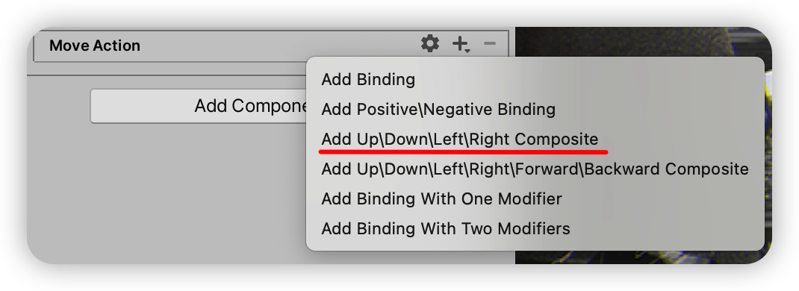

这一种InputBinding的特点是可以将多个按钮组合成基于轴的输入，因此你可以按照Up/Down/Left/Right的顺序将其与WSAD绑定起来，方法和之前绑定Jump事件的方法一样：

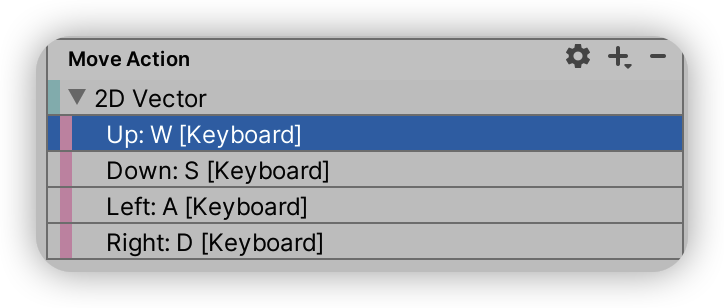

但我不仅仅想要绑定键盘事件，还希望能绑定Xbox的左摇杆，所以我们还要添加InputBinding。不过此时我们不需要添加Composite Binding，而是添加Xbox Controller > Left Stick：

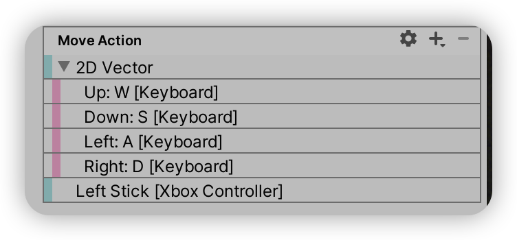

最后找到Move Action右上角的小齿轮，添加一个叫做“Stick Deadzone”的Processor来设置摇杆死区。

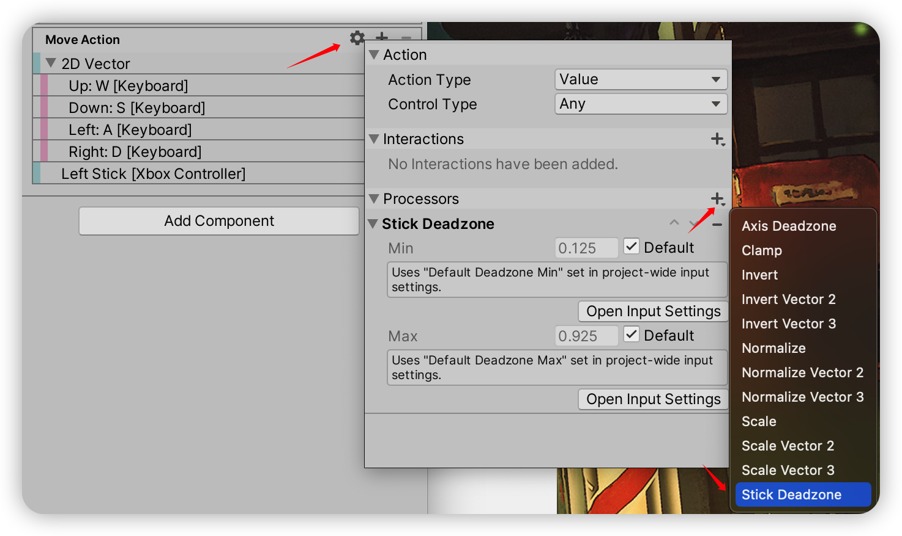

这时候你也应该会注意到一点怪异的地方，“2D Vector”这一个项目与“Left Stick [Xbox Controller]”类型明显不同，因此我们也需要从这里开始讨论Action Type这个概念与InputBindingComposite了。

#### ActionType

动作类型，也就是指ActionType，我们已经在之前配置Jump Action中见识过了（在配置Jump Action右上角的小齿轮时就见过了），在设置中我们能看到有三种ActionType：Button，Value和PassThrough。如果我们“望文生义”，那么我们可以有这样子的猜测：

- Button：按钮类型的动作
- Value：数值类型的动作
- PassThrough：不知道

最大的疑点在于PassThrough到底是什么，为了解答这个问题，我们回到[文档中查阅](https://docs.unity3d.com/Packages/com.unity.inputsystem@1.5/manual/Actions.html#action-types)可以得到下面这几个详细的定义：

ActionTypeDescription`Value`持续的监控来自设备的输入，并且在数值发生变化时引发事件。如果绑定了多个输入源，则会去选择最准确的输入源作为这个InputAction的输入方，也就是进行冲突处理。（Conflicting Inputs）该类型允许在配置时指定输出数值的类型；该类型会在Enable时检测当前的输入状态并做出相对应的反应（Initial State Check）。`Button`持续的监控来自设备的输入，并且在按键被按下时引发事件。如果绑定了多个输入源，则会去选择最准确的输入源作为这个InputAction的输入方，也就是进行冲突处理。（Conflicting Inputs）`PassThrogh`持续的监控来自设备的输入，并且在其绑定的任何设备其数值发生变化的时候引发事件。

在这里的讨论中我们能发现PassThrought是三种动作类型中最简单、最低级的动作类型，因为它并不支持输入冲突处理（Conflicting Inputs）。因此在这里我们可以确认这样子的情况：PassThroght的意思就是指输入数据直接与在InputAction基础上开发的代码交互，不会经过InputAction的输入冲突处理，但是按需满足Interactions和Processor的配置。

你会发现当ActionType为PassThrough或者为Button时，有一个可选的Initial State Check选项可选。该选项的意义是在InputAction启动时，是否要求按键复位为默认状态。比如如果Initial State Check被选中，那么当InputAction被启用时，如果我此时正按住空格键，那么在这一瞬间InputAction将会认为此时的状态为Performed；反之则为Waiting（注意：Performed和Waiting的含义将会在后面说明），此时玩家的输入将会被忽略一次。对于Value类型的ActionType，Initial State Check为默认使用的状态。

同时，如果ActionType为PassThroght或者为Value时，有一个可选的Control Type下拉菜单可选。该选项的意义是预期的控制类型，一般使用Any就可以了，如果有特别需要，则可以指定为你期望的控制类型，比如Stick或者Axis。（但我个人使用中，确实没有遇到需要特别设置的情况过）

#### InputBindingComposite

我们之前也注意到一个配置，“Left Stick [Xbox Controller]”这一个Binding其数据来源是Xbox手柄的左摇杆，也就是说数据源本身就是一个Vector2输入。但是键盘明显不是摇杆，而是按键，因此我们引入了InputBindingComposite用于组合多个按键为一个统一的，基于轴的输出。

我们通过“Add Up\Down\Left\Right Composite”创建的Binding便是这种Binding，其拥有多个带有方向的子Binding。我们可以设置子Binding的按键创建WASD的键盘输入映射，或者通过多个同方向的子Binding创建不同输入键的输入映射，比如下图。并且BindingComposite和一般的Binding一样具有Interactions和Processors。

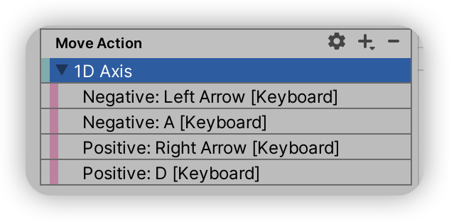

#### 如何使用API读取数值输入？

接下来我们就来讨论刚刚的问题：如何读取数值输入？InputAction提供了方法名为`InputAction.ReadValue<T>()`的函数用于提取当前数值，例如：

```csharp
InputAction n;

n.ReadValue<float>(); // 读取Axis这类具有一个float的Input
n.ReadValue<Vector2>(); // 读取Joystick、Gamepad、2D Vector Composite等具有两个值的Input
n.ReadValue<bool>();
```

所以我们读取输入的方法便是：

```csharp
private void Update()
{
    if (jumpAction.WasPressedThisFrame() && isStandOnGround())
    {
        rb.AddForce(0, jumpForce, 0, ForceMode.Impulse);
    }
    else if (moveAction.WasPerformedThisFrame())
    {
        var axis = moveAction.ReadValue<Vector2>();
        SetMovementDireciton(axis);
    }

    UpdateMovementDirection();
}
```

我们在Unity中配置的“Move Action”是一个具有两个纬度输入的Vector2，因此我们在此处可以直接读取为Vector2。

## 深入探讨

接下来，我们通过几个问题开始深入的探讨InputAction——终于不用大量截图了。

### 为什么InputAction需要单独进行Enable？

我们参照[官方的文档](https://docs.unity3d.com/Packages/com.unity.inputsystem@1.5/api/UnityEngine.InputSystem.InputAction.html)，抛开里面杂七杂八的内容，我们精简的来讲就是：**InputAction本质上是一个按键事件监听器**，它会在每一次Input更新的时候去康康与自己绑定的Input事件类型（比如我们之前绑定的键盘空格与Xbox的B键）是否发生。但InputAction又不仅仅是一个简单的监听器，它同时还可以记录事件发生的上下文，并且按照我们追加设置的规则来过滤事件、修改结论，比如我们刚刚设计的双击响应与设置死区。

但是InputAction不仅仅可以被Enable，还可以被Disable与Dispose。Disable通常应用于这样子的场景——当UI打开的时候，你不希望玩家响应输入事件；或者当玩家失去能力的时候，Disable掉InputAction就能关闭掉玩家的能力。

我这里建议你最好不要忘记Dispose掉InputAction，毕竟一旦一个对象提供了Dispose接口，那么极有可能会创建非托管对象（也就是不会被GC回收的内存），如果你不希望导致内存溢出，那么一定要记牢当InputAction不再使用时，一定要Dispose掉它。（正如之前的例子，我在OnDestory阶段将该对象Dispose了）

### 为什么`WasPerformedThisFrame()`能正确响应双击和移动？

我们讨论这个API之前，我们首先需要追加对于Interactions和Processors的追加说明。

#### InputAction处理流水线：Interactions与Processors

任何的InputAction都具有Interactions和Processors，而在之前的实践中，各位应该能观察到Interactions的主要用途是定义Action具体是如何触发的模式，比如双击或者长按；而Processors则是用于处理ReadValue所读取到的数值，比如设置死区与缩放数值。二者独立运行，并不会影响相互的行为。

既然Processor关联的API是`ReadValue<T>()`，那么联想猜测`WasPerformedThisFrame()`是与Interactions所关联的API，而事实确实如此。那么什么叫做Performed呢？接下来我们将要引出这一节的重点：Phase。

#### InputActionPhase

Phase指的是行为的阶段。我们为什么需要说分阶段呢？当按钮被按下的时候，由于有Interactions的存在，此时输入源一定有检测到输入事件，但是不能保证满足Interactions所设置的条件，因此我们便产生了分阶段触发事件的概念。这里的InputActionPhase存在目的便是如此。而Phase根据不同的配置方法，其过程不一定会一样。

访问`InputAction.phase`会得到以下值（把[文档](https://docs.unity3d.com/Packages/com.unity.inputsystem@1.5/api/UnityEngine.InputSystem.InputActionPhase.html)翻译然后依照实际测试整理了一下）：

NameActionType = ButtonActionType = ValueActionType = PassThrough`Disabled`InputAction并未被启用。查询`InputAction.enabled`为`false`的时候，必会得到该值·；
使用`InputAction.Enable()`退出该状态，使用`InputAction.Disable()或`InputAction.Dispose()`回到该状态。同左同左`Waiting`InputAction启用，但是并未满足任何其他状态的情况时。同左同左`Started`当InputAction存在Interactions时，所绑定的InputBinding被按住时触发；
否则在进入Performed之前被触发一次。当InputAction存在Interactions时，其绑定的InputBinding被操作时触发；
如果没有设置Interactions，则当数值变化为非默认值时触发。当InputAction存在Interactions时，则视具体输入类型而定；
否则无此状态`Performed`当InputAction存在Interactions时，满足了`Started`事件，并且满足其Interactions条件时触发；
如果没有Interactions，则为其绑定的InputBinding按下时触发。如果存在Interactions，则在满足Interactions的条件之后才能到达此状态，并且只会执行一次；
如果没有Interactions，则在数值并非默认值且数值发生变化时触发。当InputAction存在Interactions时，则视具体输入类型而定；
如果没有Interactions，则在经数值发生任何变化时触发。`Canceled`当InputAction存在Interactions时，满足了`Started`事件，但是在Interactions无法实现条件时或者在`Started`阶段时被关闭时触发；
如果没有Interactions，则在`Performed`状态结束，返回`Waiting`状态之间时或者在`Started`阶段时被关闭时触发。当数值变化为默认值时触发。当InputAction存在Interactions时，则视具体输入类型而定；
如果没有Interactions，则在设备变化引发输入中断时或者InputAction被设置为关闭时触发。

虽然有点复杂，但是你可以基本理解为所有动作大体上都会遵循这样的规律：`Disabled => Waiting => Started => loop(Started) => Performed/Canceled => Waiting => ... => Disabled`

PassThrough的策略有一点不太一样。PassThrough在没有Interaction的情况下，表现则非常简单粗暴——动不动就进入`Performed`；但是一旦设置了Interactions，则会按照其具体来源而产生变化，例如输入源是Button的话，那么模式就变化为Button，如果输入源是Value，那么模式变化为Value。

对于Value类型，需要提示的一点是其计算Phase所读取的数值并非来自Processor处理后的数值，而是原始数值。

但是如果我们想通过`InputAction.phase`去做详细控制，则会遇到一个问题：phase改变的时机和帧更新的时间并不同步。（这个原因就是为什么会有`WasXXThisFrame()`这种API的原因，可以让整个帧都保留帧开始时的状态，从而防止在帧内输入有变化导致的BUG）也就是说如果直接去查询phase的话可能会漏查`Performed`或者`Canceled`类型的状态（因为二者都非常的短暂）。此时我们就需要通过注册事件的方式来规避这个问题。

#### 使用回调响应Phase的变化

为了解决这个问题，我们引入了回调的方法来解决这个问题。具体来说请看下面这个例子：

```csharp
jumpAction.started += ctx => Debug.Log("Started " + ctx); // Phase = Started
jumpAction.performed += ctx => Debug.Log("Performed " + ctx); // Phase = Performed
jumpAction.canceled += ctx => Debug.Log("Canceled " + ctx); // Phase = Canceled
```

这三个回调会在状态发生变化时被调用。当Phase进入了某个状态后，他们将会在进入后第一时间被调用，通过这种办法我们可以克服查询不同步的问题，从而将输入变化为事件驱动模式。

#### 那么回到最开始的问题

请看这一个API：

APIReturnDescription`WasPerformedThisFrame()``bool`在这一帧中的任意时刻中，Phase是否为`Performed`，只要Phase为`Performed`过，则返回true，否则返回false。

结合Phase表，我们可以观察到，当状态为`Perform`时，无论是Jump还是Move行动，都会满足我们所需要的按钮被操作。因此我们在此时执行动作则可以保证行为的正确性，同时让配置动作的机会让给了Unity Editor，从而实现了输入到执行的分离。这就是正确响应的来源。

## 总结

这一篇文章大量参考了InputSystem的文档：[Class InputAction](https://docs.unity3d.com/Packages/com.unity.inputsystem@1.2/api/UnityEngine.InputSystem.InputAction.html)，个人建议在看完本文之后，你可以简单构建输入后，再去仔细阅读一下这一篇文章。

本文覆盖到的部分并不全面，比如InputSystem具有分层的构架，但是我只给你处于中间层讲了InputAction，甚至都没给你具体讲解构架图；我只讲解了如何构建双击事件，但并没有告诉你如何构建长按事件（但是其构造逻辑本质上是相通的，甚至连配置的位置都是一样的，只是需要做一点小小的改动即可。所以剩下来的时间，你可以尝试用InputSystem改造一下你曾经做过的小玩意，练习一下它最基本的使用方法）。

如果你之前看过其他地方的文章，他们会从教你怎么用构建InputActionAsset来构建输入事件为出发点讲解InputSystem，这也就是我下一篇文章计划讨论的主题——如何用一份外部的配置文件来构造InputAction。我认为很多文章从InputActionAsset为出发点讲解是有问题的，因为初学者并不能快速的理清楚InputActionAsset背后代表的东西是什么。本质上InputActionAsset是InputAction的集合体，因此我认为从最基础的构成单元讲起可以让你理解为什么需要这么做的内在逻辑与发展规律。

当然在这之外还有更多的内容，比如向下走的InputControl是什么、InputUser和InputDevice是如何抽象底层输入的、向上走的InputActionMap、InputActionSchema和PlayerInput又是什么，但是这一切的内容都需要我慢慢去组织内容。从一个相对中间的、但是易于理解的抽象出发，我希望这篇文章能让你更加清楚的了解InputSystem怎么学习，从而思考好的Input体系要如何建立的问题。
