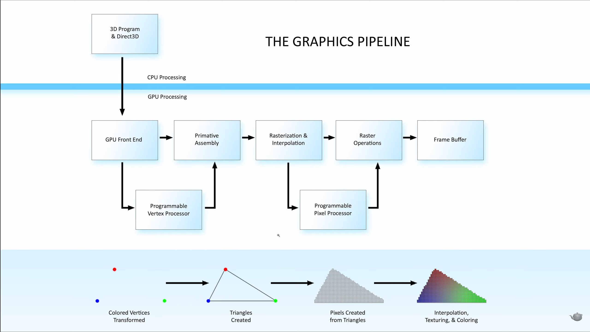
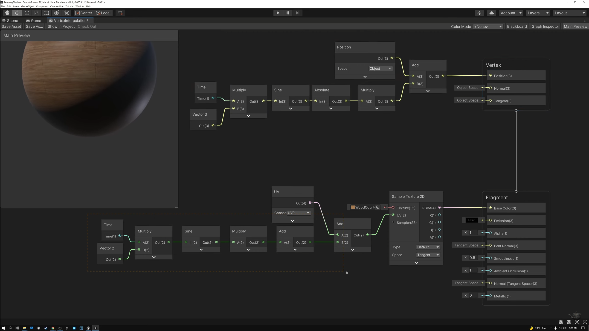

## GPU渲染管线

- 3D Program & Direct3D：来自上层的3D图形应用程序以及其调用的显卡API（Direct3D API）。
- GPU Front End：接受CPU指令的GPU解码前端。
- Programmable Vertex Processor （Vertex Shader）：对顶点数据进行操作的可编程Shader，通常效率更高。
- Primative Assembly：图元组装（也就是对顶点进行三角形的组装并生成对应的向量图形数据）
- Rasterization & Interpolation：对向量图形进行栅格化，并对颜色与贴图进行插值操作。
- Programmable Pixel Processor（Pixel Shader）：对生成图形的每个像素进行操作的可编程Shader，通常效率较低。
- Raster Operations：渲染输出单元，囊括了抗锯齿、颜色压缩等光栅化计算任务。
- Frame Buffer：将生成结果写入图形缓冲区（帧缓存）。

其中Pragrammable Vertex Processor和Programmable Pixel Processor是一个中间的步骤，在这个步骤中可以对图形信息进行操作，比如调整顶点的位置、修改UV的映射或者叠加颜色。

需要注意的是，游戏引擎通常会使用GBuffer（Deffer Renderer，延迟渲染）。也就是说这里会要求Pixel Shader输出颜色、法线、金属度或粗糙度等信息写入GBuffer，然后在进行光照处理的时候再从GBuffer中取出数据进行计算并渲染到画面中。

## Shader Graph中的Shader输出与管线的关系

Unity Shader Graph将渲染程序显式的分为了Vertex Shader和Fragment Shader（Pixel Shader）。因此我们可以直接通过连接数据出口到Vertex Part或者Fragment Part以调用对应的Shader。

## 参考资料

主要来自：[https://www.youtube.com/watch?v=ZEXVQgbWxQY](https://www.youtube.com/watch?v=ZEXVQgbWxQY)

Raster Operation相关：[https://linustechtips.com/topic/617862-what-are-rops-and-do-they-matter/](https://linustechtips.com/topic/617862-what-are-rops-and-do-they-matter/)
