## 什么是PBR

PRB全称Physically Based Rendering（基于物理的渲染），其目前是让画面的渲染尽可能接近真实世界的样式。

PBR主要由两部分组成：Light Properties和Surface Properties，其分别代表的是光线的属性和材质表面的属性。

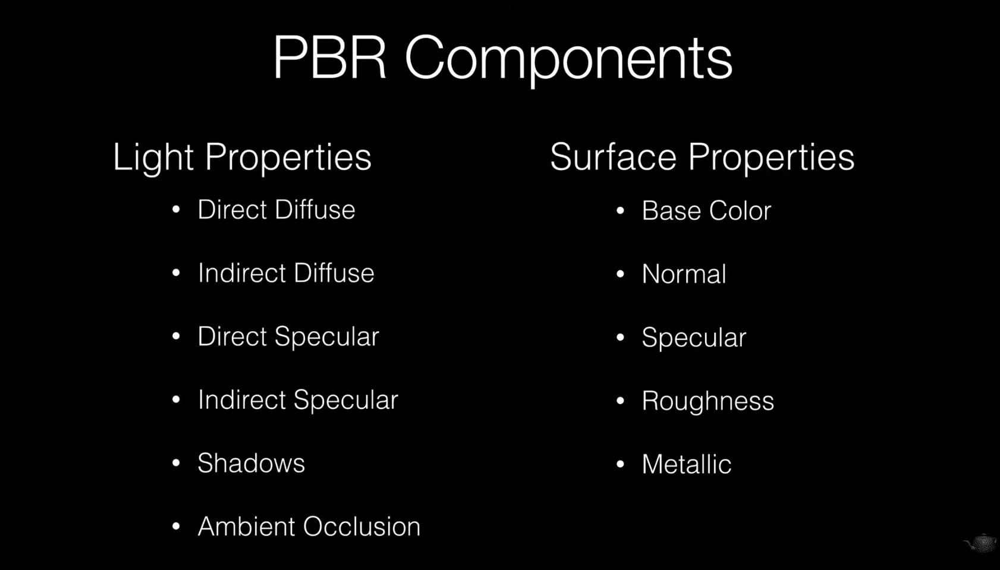

## 光线特征

按照光线方向可以将光分为这四种类似：

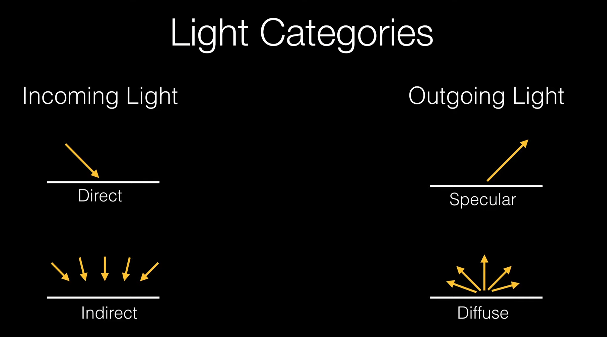

也就是说其特性为一个2x2的表格，分别是光线方向（入光还是出光）与光线漫反射参数（漫反射还是镜面反射）。而按照光线反射特点，必然存在入光与出光组合，也就是说我们可以将上面这个表通过组合得到下面四种组合方式：

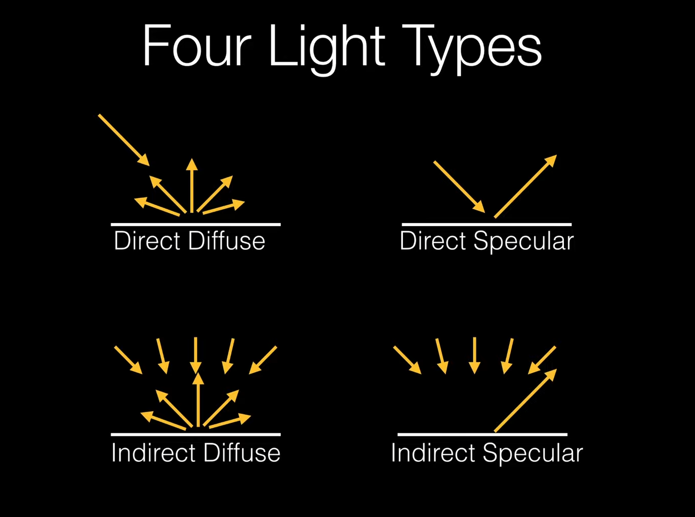

## 四种光线类型

按照刚刚组合得到的四种光线类型，我们分别讨论其内在特征：

### 漫反射

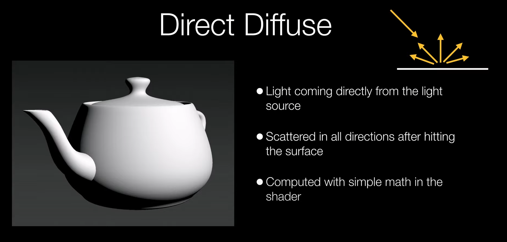

这一种光线是直入射光漫反射（漫反射）。其计算方法特别的简单，只需要通过法线去计算受光面与光线的夹角就可以得到这一个位置的光照强度。具体来讲是下面这个公式（兰伯特漫反射公式）：

```
C_{diffuse}=C_L \times M \times \max{(0,\cos {(\overrightarrow L,\overrightarrow N)})}

```

其中[katex]C_L[/katex]指的是光线强度，[katex]M[/katex]指的是材质的漫反射颜色，而[katex]\overrightarrow L[/katex]为光线单位向量，[katex]\overrightarrow N[/katex]为受光面法向量。

### 高光反射

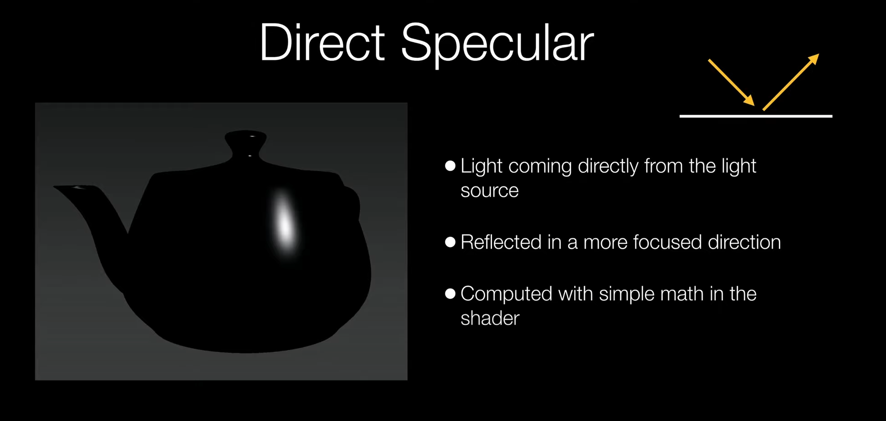

这一种光线是直入射光镜面反射（高光反射）。其计算也是同样的简单，和上一条公式类似，也是一个系数与和向量相关的算式相乘得到结果：

```
C_{specular}=C_{L} \times  M \times \max{(0, (\overrightarrow V \cdot \overrightarrow R))^{m_{gloss}}}
```

其中[katex]C_L[/katex]指的是光线强度，[katex]M[/katex]指的是材质的高光颜色，而[katex]\overrightarrow L[/katex]为光线单位向量，[katex]\overrightarrow N[/katex]为受光面法向量，而[katex]m_{gloss}[/katex]指的是材质的反射度。

### 环境光照

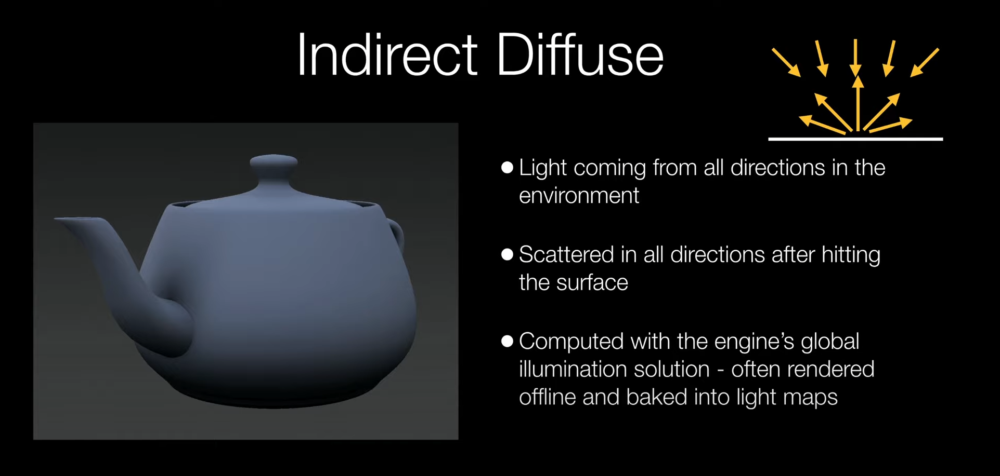

这一种光线是漫反射入射漫反射（环境光照）。这个计算相对会复杂不少，本质上和之前的公式很类似，但是不同点在于入射光线数量增加了不少，因此也导致了游戏引擎通常会考虑离线渲染后烘培到模型上。

### 环境反射

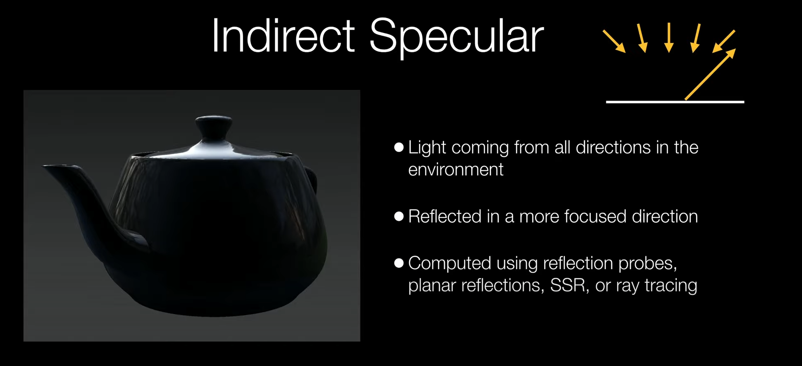

最后一种光线是漫反射入射镜面反射（环境反射）。这个计算也挺复杂的，一般漫反射入射光照由于其光线特征都会导致计算复杂。通常在存在Ray Tracing引擎的情况下，我们可以使用Ray Tracing算法实现计算。如果不存在这种引擎的话，那么我们可以通过Reflection Probe（反射探头）将环境反射信息烘培模型上。

## 表面特征

表面特征控制的是材质表面的特性，以模拟真实世界物理的方式描述材质的属性。

## Base Color

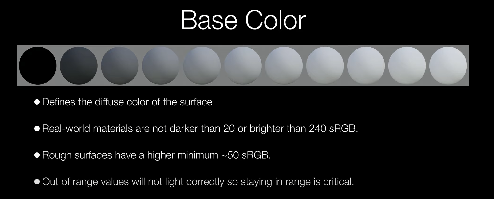

这个属性控制的是材质漫反射颜色，或者可以理解为材质表面的基本颜色，一般真实世界的材质颜色不会低于20（粗糙表面一般未50起步）或者高于240的sRGB。

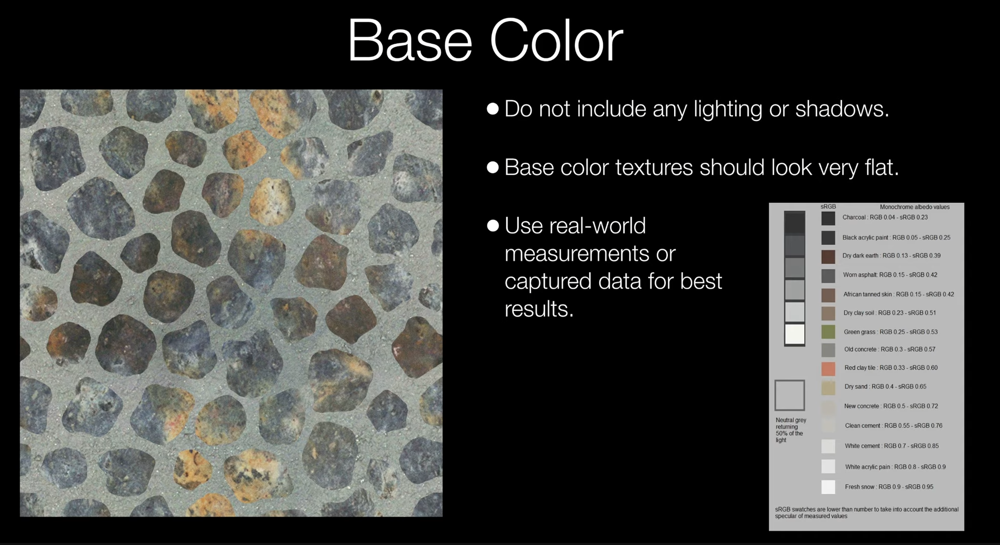

### Normal

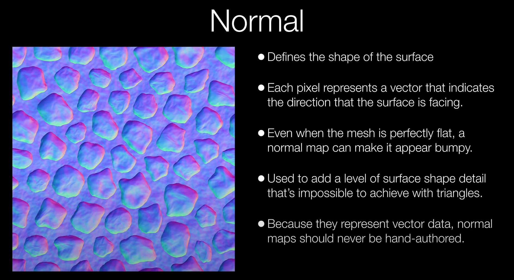

法线控制了表面的形状。在材质模型本身提供的表面形状基础上，法线图可以提供更加细节的形状信息，用于节省模型的顶点数量或者实现一些使用三角形图元无法生成的细节信息。

每一个像素点所表达的是其对应面相对于模型本身法线的朝向，而这个向量数值由RGB三个通道提供。

### Specular

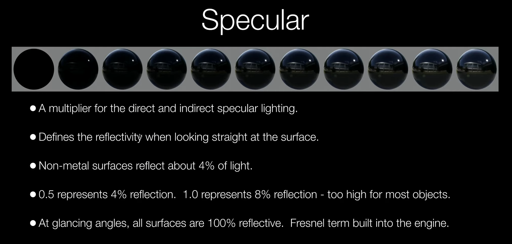

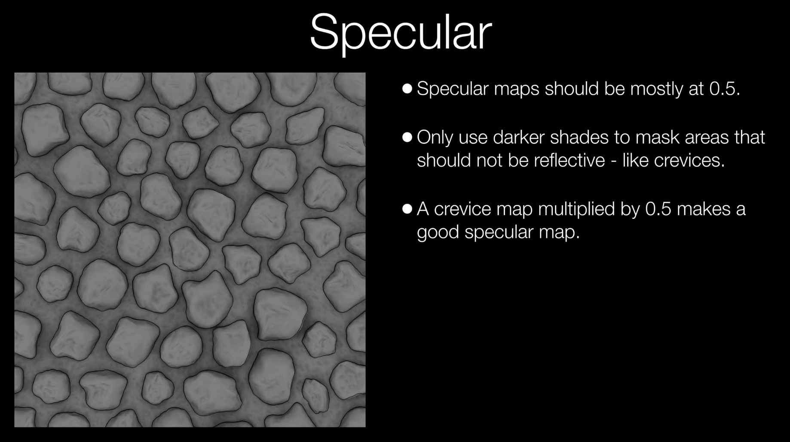

Specular控制了材质表面的光线反射能力，其数值越大，反射能力越强，或者说其反射光的量更大（但并不代表漫反射和镜面反射的比例）。

Glancing Angle指的是掠射角，其特点是与入射角90度互补。

### Roughness

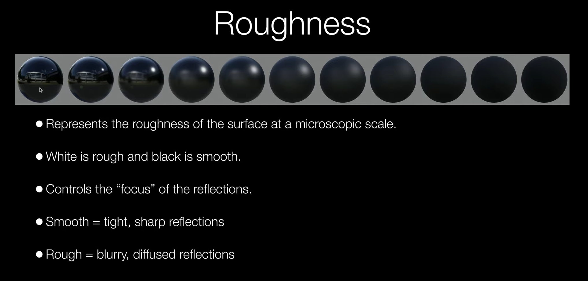

Roughness控制了一个表面有多粗糙的特性。一个Rough的表面，其光线反射会更加接近于漫反射。在Unity中，Roughtness被Smoothness代替，其关系为：

```
M_{Roughness} = 1 - M_{Smoothness}
```

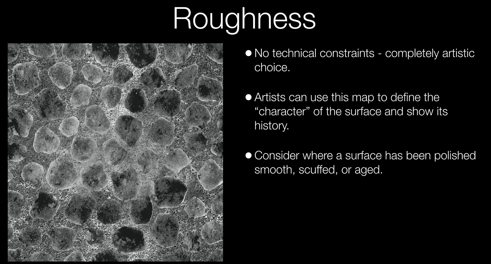

### Metallic

Metallic指的是材质表面的金属度，但引擎中通常将材质按照是否使用金属度分为两种不同的材质：金属材质和非金属材质。其特点如下图。

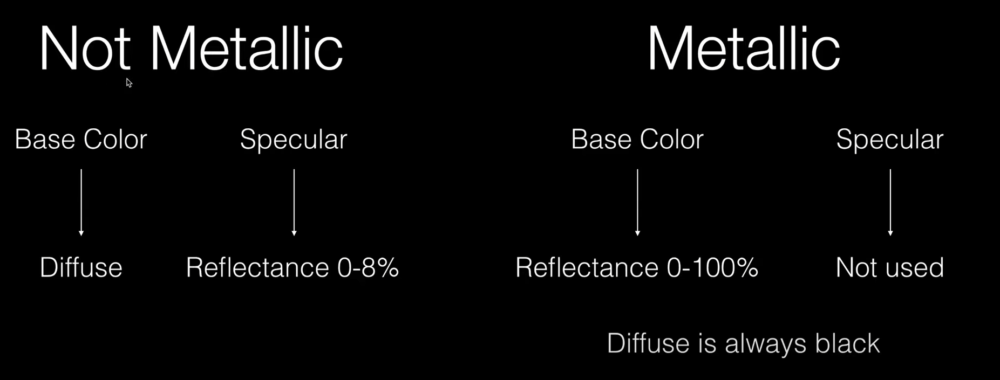

也就是说金属材质不适用漫反射，其漫反射参数将会直接变为反射度（金属的反射能力将会远大于非金属材质的反射能力）。

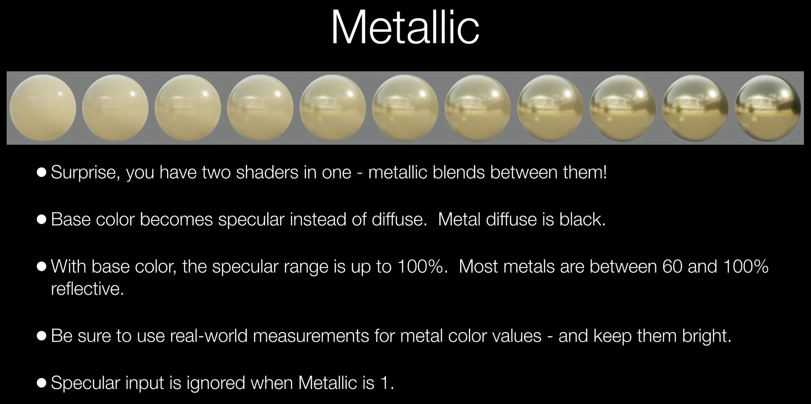

在Unity中，我们无需担心Specular会被忽略的问题——Unity会强制要求在金属材质和非金属材质中二选一，以防参数忽略的问题。

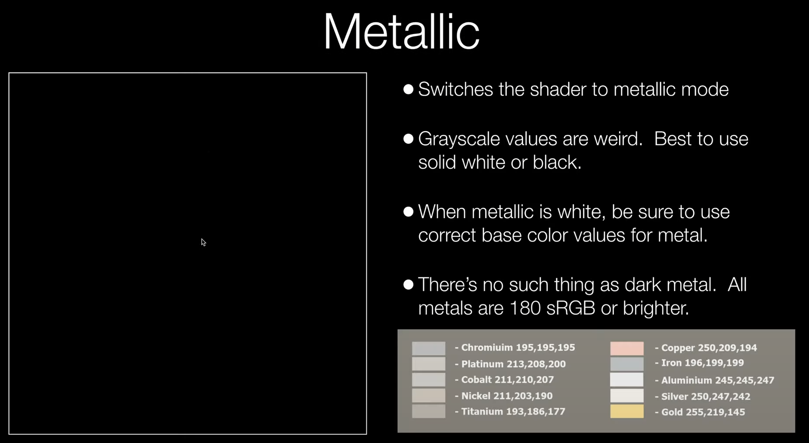

上图的右下角提供了一个可供参考的金属BaseColor选项，最好使用参考颜色来设计金属的颜色。同时Metallic最好要么全黑要么全白，否则效果会很奇怪。

## 参考资料

视频：[https://www.youtube.com/watch?v=fePsD_8p9vM](https://www.youtube.com/watch?v=fePsD_8p9vM)

[https://blog.csdn.net/weixin_44279708/article/details/103945615](https://blog.csdn.net/weixin_44279708/article/details/103945615)

[https://www.cnblogs.com/kekec/p/15808379.html](https://www.cnblogs.com/kekec/p/15808379.html)
